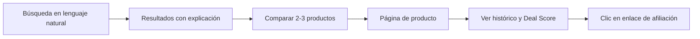

# 03 — User Flows

Flujos principales del MVP. Cada uno debe poder completarse sin fricción antes de añadir funcionalidad de fases posteriores.

## Flujo 1 — Descubrir y comprar

## Flujo 2 — Descubrir vía ofertas

1. Home → sección de ofertas.
2. Filtrar por categoría.
3. Abrir una oferta → ver por qué es una oferta (Deal Score, mínimo histórico, precio de referencia a 30 días).
4. Producto → alternativas → comparación opcional.

## Flujo 3 — Crear y recibir una alerta de precio

1. En página de producto: "avísame si baja de X€" (o "avísame de cualquier bajada").
2. Confirmación (requiere cuenta o email).
3. Job periódico detecta que el precio cruza la condición.
4. Notificación por email (MVP) — Telegram en V1.
5. El enlace de la notificación lleva directo al producto.

## Flujo 4 — Telegram (V1, no MVP)

1. Usuario inicia el bot → vincula su cuenta (opcional) o sigue productos sin cuenta.
2. `/seguir <producto>` → confirmación.
3. Recibe alertas respetando los límites de envío documentados en `14-telegram.md`.
4. Puede consultar `/alertas` para ver lo que sigue.
