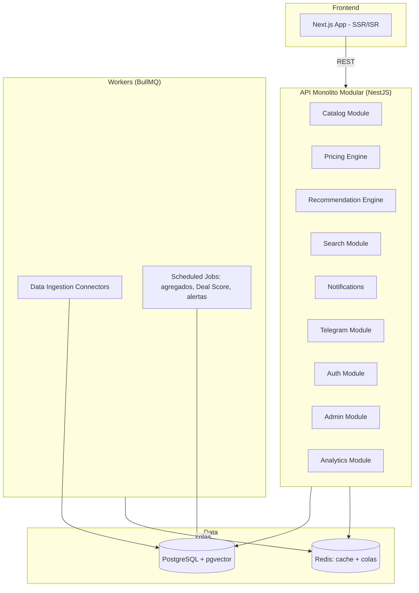

# 06 — Architecture

Propuesta de la fase de discovery — ver `24-decision-log.md` para el razonamiento detallado de cada elección y `25-open-questions.md` para lo que queda pendiente de confirmar (sobre todo hosting/región e infraestructura de LLM en runtime).

## Estilo: monolito modular

No microservicios prematuros. Un único servicio backend (NestJS) organizado en módulos con límites de dominio claros, más workers separados para trabajo asíncrono. Migrar un módulo concreto a servicio independiente es una opción futura si el volumen lo justifica — no un objetivo del MVP.

## Módulos de dominio (backend)

Catalog · Pricing Engine · Recommendation Engine · Search · Notifications · Telegram · Auth · Admin · Analytics · Data Ingestion (workers). Cada uno vive en su propio módulo NestJS con fronteras explícitas — un agente no debe importar directamente entre módulos sin pasar por su interfaz pública.

## Stack propuesto y justificación

| Capa | Elección | Por qué |
|---|---|---|
| Frontend | Next.js (React, TypeScript) | SSR/ISR necesario para SEO en producto/categoría/comparación (crítico para el modelo de negocio); ecosistema maduro para gráficas de precio y data-fetching |
| Backend | Node.js/TypeScript + NestJS | La estructura modular obligatoria de NestJS mapea 1:1 con los límites de dominio pedidos, lo que ayuda a que un agente no mezcle responsabilidades entre módulos |
| Base de datos | PostgreSQL + extensión pgvector | Integridad relacional fuerte para precios/históricos (auditable, no un blob) + búsqueda semántica sin añadir una base de datos vectorial aparte en el MVP |
| Proveedor gestionado (opción) | Supabase u otro Postgres gestionado en región UE | Postgres + pgvector + Auth + Storage en un solo proveedor reduce piezas de infraestructura en el MVP; región UE relevante para GDPR |
| Colas / cache | Redis + BullMQ | Ingestión programada, cálculo de agregados y envío de notificaciones (incl. Telegram) con reintentos y control de rate limits |
| ORM | Prisma | Tipado end-to-end en TypeScript, migraciones versionadas |
| Búsqueda | Postgres full-text + pgvector (híbrida) | Suficiente para el volumen del MVP; motor dedicado (Meilisearch/Typesense) solo si se demuestra necesario — ver `12-search.md` |

## Fuera de alcance para el MVP

Microservicios, base de datos vectorial dedicada, motor de búsqueda dedicado, multi-región, colas distribuidas complejas.

## Pendiente de decisión (no técnico puro)

- Proveedor y región de hosting definitivos (coste real) — `25-open-questions.md` #5.
- Qué LLM se llama en tiempo de ejecución para intent parsing/explicaciones — es una decisión **separada** de qué agente de IA escribe el código (Kimi/GLM son herramientas de desarrollo, no necesariamente el motor de inferencia de la app en producción) — `25-open-questions.md` #4.
