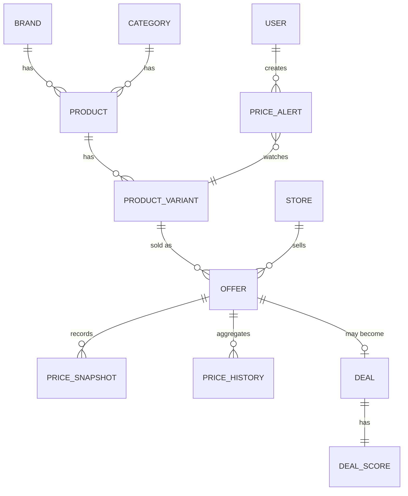

# 07 — Data Model

## Notas de diseño importantes

- **PriceSnapshot vs PriceHistory:** PriceSnapshot es un log de eventos append-only — nunca se edita ni se borra, cada ingestión añade una fila. PriceHistory son agregados materializados (por día/semana) calculados a partir de los snapshots, para no recalcular percentiles sobre millones de filas en cada request. Ver `10-pricing-engine.md`.
- **Deal vs Offer:** un Offer es la combinación vendible producto-variante + tienda + precio. Un Deal es un objeto derivado: se materializa automáticamente cuando el DealScore de un Offer cruza un umbral — nunca se crea a mano.
- **DealScore vs ProductScore:** DealScore mide si el precio ACTUAL de una oferta es bueno, independientemente de si encaja con la búsqueda de alguien. ProductScore mide el encaje de un producto con una búsqueda concreta (motor de recomendación). Son señales distintas que pueden combinarse en la UI, pero se calculan por separado — ver `10-pricing-engine.md` y `11-recommendation-engine.md`.
- **ProductReview en el MVP:** siempre agregada/atribuida a la fuente (rating y nº de reseñas que ya trae el retailer) — nunca generada ni inventada. Reseñas nativas de usuarios en ORZAR son una decisión aparte, ver `25-open-questions.md` #8.

## Diagrama simplificado (entidades núcleo)

## Entidades

| Entidad | Propósito | Campos clave | Relaciones |
|---|---|---|---|
| Brand | Marca del producto | id, name, slug, logo_url | 1—N Product |
| Category | Categoría, jerárquica | id, name, slug, parent_category_id | 1—N Product |
| Product | Producto canónico | id, brand_id, category_id, title, description, canonical_specs (jsonb) | 1—N ProductVariant |
| ProductVariant | Variante (color, talla...) | id, product_id, variant_attributes (jsonb) | 1—N Offer |
| ProductFeature | Spec normalizada y filtrable | id, product_id, feature_key, feature_value, is_filterable | N—1 Product |
| Store | Tienda/fuente | id, name, base_url, connector_type | 1—N Offer |
| Offer | Producto+variante vendible en una tienda | id, product_variant_id, store_id, external_product_url, current_price, currency, is_active | 1—N PriceSnapshot, 1—N PriceHistory, 0—1 Deal |
| PriceSnapshot | Punto de precio ingerido (inmutable) | id, offer_id, price, captured_at | N—1 Offer |
| PriceHistory | Agregado por periodo (día/semana) | id, offer_id, period_start, period_type, min, max, avg, median | N—1 Offer |
| ProductScore | Encaje de un producto con una búsqueda | id, product_id, search_id, requirement_match, price_value, quality_signal, overall | N—1 Product, N—1 Search |
| Deal | Oferta marcada como buena (derivado) | id, offer_id, deal_score_id, materialized_at, is_active | 1—1 DealScore |
| DealScore | Desglose de por qué es (o no) buena oferta | id, offer_id, historical_position_score, discount_magnitude_score, reference_reliability_score, overall_0_100, computed_at | 1—1 Deal |
| Comparison | Log de comparaciones realizadas | id, user_id (nullable), product_ids[], created_at | |
| Search | Log de búsquedas | id, user_id (nullable), raw_query, parsed_requirements (jsonb), created_at | 1—N Recommendation |
| Recommendation | Qué se recomendó, por qué, para qué búsqueda | id, search_id, product_id, rank, overall_score, explanation_text | N—1 Search, N—1 Product |
| User | Cuenta | id, email, password_hash, role, created_at | 1—N PriceAlert |
| PriceAlert | Alerta de precio | id, user_id, product_variant_id, target_price (nullable), condition_type, is_active | N—1 User, N—1 ProductVariant |
| Notification | Envío de una alerta | id, user_id, channel, related_alert_id, status, sent_at | N—1 PriceAlert |
| TelegramUser | Vínculo con Telegram | id, user_id (nullable), telegram_chat_id, linked_at | 0/1—1 User |
| AffiliateLink | Plantilla de enlace de afiliado por tienda | id, store_id, tracking_id, url_template | N—1 Store |
| ProductReview | Rating agregado de la fuente | id, product_id, source, rating_avg, review_count, source_url | N—1 Product |

## Transversal

Todas las tablas: `created_at`, `updated_at`. Tablas de catálogo (Product, Offer, Category, Brand): soft delete (`deleted_at`) en vez de borrado físico — un producto que desaparece de una tienda no debe perder su histórico de precios. Índices mínimos: `Offer(product_variant_id, store_id)`, `PriceSnapshot(offer_id, captured_at)`, `Product(category_id)`, y el índice vectorial de pgvector sobre el embedding de producto para búsqueda semántica.
